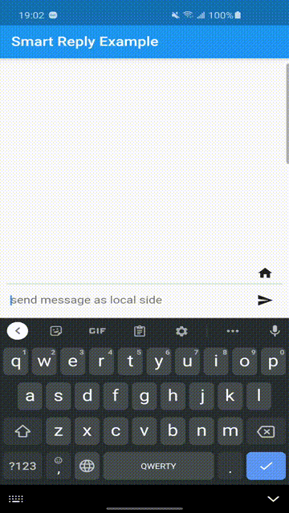

# flutter\_smart\_reply

A flutter plugin to wrap Google's Smart Reply library.

https://developers.google.com/ml-kit/language/smart-reply

## Features

With ML Kit's Smart Reply API, you can automatically generate relevant replies to messages. Smart Reply helps your users respond to messages quickly, and makes it easier to reply to messages on devices with limited input capabilities.

## Demo


## Installation

Following steps will help you add this library as a dependency in your flutter project.

- In the `pubspec.yaml` file in the root of your project

```yaml
dependencies:
  flutter_smart_reply: ^0.0.1
```

- Run the following command to get packages:

```bash
$ flutter pub get
```

- In your project-level `build.gradle` file, make sure to include Google's Maven repository in both your buildscript and allprojects sections.

- Add the dependencies for the ML Kit Android libraries to your module's app-level gradle file, which is usually app/build.gradle: 

```gradle
dependencies {
  // ...
  implementation 'com.google.mlkit:smart-reply:16.1.0'
}
```
- Also in your app-level `build.gradle` file, disable compression of tflite files: 

```gradle
android {
    // ...
    aaptOptions {
        noCompress "tflite"
    }
}
```

- Import the package in your project file:

```dart
import 'package:flutter_smart_reply/flutter_smart_reply.dart';
```

## Usage

For a more detailed look at how to use this library, there is a sweet project in the `example` directory and various examples can be found [here](/example/README.md)

A simple example usage is shown below:

```dart
import 'package:flutter_smart_reply/flutter_smart_reply.dart';

void main() {
  runApp(MyApp());
}

class MyApp extends StatefulWidget { ... }

class _MyAppState extends State<MyApp> {

  // a list to track what text messages are added.
  List<TextMessage> _textMessages = [];

  // a list to sotre suggested reply messages.
  List<String> _replies = List.empty();

  // whether the message is from local side or remote side
  bool isSelfMode = true;

  // when _textMessages are updated, we call this function to update the suggested replies.
  Future<void> updateSmartReplies() async {
    try {
      _replies = await FlutterSmartReply.getSmartReplies(_textMessages);
    } on PlatformException {}
  }

  @override
  Widget build(BuildContext context) {...}
  
  
  // when a new message text is added, 
  Future<void> _addMessage(String message) async {

    _textMessages.add(isSelfMode
        ? TextMessage.createForLocalUser(message, DateTime.now().millisecondsSinceEpoch)
        : TextMessage.createForRemoteUser(message, DateTime.now().millisecondsSinceEpoch));

    await updateSmartReplies();

    if (!mounted) return;

    isSelfMode = !isSelfMode;

    setState(() {});
  }  

```


